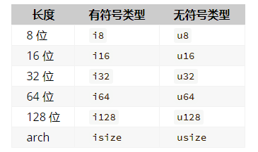

# 数据类型
Rust 是一种静态类型（statically typed）的语言，这意味着它必须在编译期知道所有变量的类型。

## 标量类型
标量（scalar）类型表示单个值。Rust 有 4 个基本的标量类型：整型、浮点型、布尔型和字符。你可能从其他语言了解过这些类型。

### 整数类型
整数（integer）是没有小数部分的数字。

此类型声明表明它关联的值应该是占用 32 位空间的无符号整型（有符号整型以 i 开始，i 是英文单词 integer 的首字母，与之相反的是 u，代表无符号 unsigned 类型）。



有符号和无符号表示数字能否取负数

整型默认是 i32

#### 整型溢出
+ 比方说有一个 u8 ，它可以存放从 0 到 255 的值。那么当你将其修改为范围之外的值，比如 256，则会发生整型溢出（integer overflow），
这会导致两种行为的其中一种。当在调试（debug）模式编译时，Rust 会检查整型溢出，若存在这些问题则使程序在编译时 panic。
Rust 使用 panic 这个术语来表明程序因错误而退出。

+ 在当使用 --release 参数进行发布（release）模式构建时，
Rust 不检测会导致 panic 的整型溢出。
相反当检测到整型溢出时，Rust 会进行一种被称为二进制补码包裹（two’s complement wrapping）的操作。
简而言之，大于该类型最大值的数值会被“包裹”成该类型能够支持的对应数字的最小值。
比如在 u8 的情况下，256 变成 0，257 变成 1，依此类推。
程序不会 panic，但是该变量的值可能不是你期望的值。
依赖整型溢出包裹的行为不是一种正确的做法。

要显式处理溢出的可能性，可以使用标准库针对原始数字类型提供的以下一系列方法：
+ 使用 wrapping_* 方法在所有模式下进行包裹，例如 wrapping_add
+ 如果使用 checked_* 方法时发生溢出，则返回 None 值
+ 使用 overflowing_* 方法返回该值和一个指示是否存在溢出的布尔值
+ 使用 saturating_* 方法使值达到最小值或最大值

### 浮点类型
+ 浮点数（floating-point number）是带有小数点的数字，在 Rust 中浮点类型（简称浮点型）数字也有两种基本类型。
+ Rust 的浮点型是 f32 和 f64，它们的大小分别为 32 位和 64 位。
+ 默认浮点类型是 f64，因为在现代的 CPU 中它的速度与 f32 的几乎相同，但精度更高。
+ 所有浮点型都是有符号的。
+ f32 类型是单精度浮点型，f64 为双精度浮点型。

```rust
fn main() {
    let x = 2.0; // f64

    let y: f32 = 3.0; // f32
}
```

### 数字运算
+ Rust 支持所有基本的算术运算符，包括加法、减法、乘法、除法和取模运算。
+ 整数除法会向下取整。

```rust
fn main() {
    // addition
    let sum = 5 + 10;

    // subtraction
    let difference = 95.5 - 4.3;

    // multiplication
    let product = 4 * 30;

    // division
    let quotient = 56.7 / 32.2;
    let floored = 2 / 3; // Results in 0

    // remainder
    let remainder = 43 % 5;
}
```

### 布尔类型
+ 布尔类型也有两个可能的值：true 和 false。
+ 布尔值的大小为 1 个字节。
+ 布尔类型使用 bool 声明。

```rust
fn main() {
    let t = true;

    let f: bool = false; // with explicit type annotation
}
```
使用布尔值的主要地方是条件判断，如 if 表达式。

### 字符类型
Rust 的 char（字符）类型是该语言最基本的字母类型

```rust
fn main() {
    let c = 'z';
    let z = 'ℤ';
    let heart_eyed_cat = '😻';
}
```
+ char 字面量采用单引号括起来，这与字符串字面量不同，字符串字面量是用双引号括起来。
+ Rust 的字符类型大小为 4 个字节，表示的是一个 Unicode 标量值，这意味着它可以表示的远远不止是 ASCII。
  标音字母，中文/日文/韩文的文字，emoji，还有零宽空格(zero width space)在 Rust 中都是合法的字符类型。
  Unicode 值的范围为 U+0000 ~ U+D7FF 和 U+E000~U+10FFFF。

## 复合类型
复合类型（compound type）可以将多个值组合成一个类型。Rust 有两种基本的复合类型：元组（tuple）和数组（array）。

### 元组类型
元组是将多种类型的多个值组合到一个复合类型中的一种基本方式。元组的长度是固定的：声明后，它们就无法增长或缩小。

我们通过在小括号内写入以逗号分隔的值列表来创建一个元组。元组中的每个位置都有一个类型，并且元组中不同值的类型不要求是相同的。
```rust
fn main() {
    let tup: (i32, f64, u8) = (500, 6.4, 1);
}
```

变量 tup 绑定到整个元组，因为元组被认作是单个复合元素。 想从元组中获取个别值，我们可以使用模式匹配来解构（destructure）元组的一个值

```rust
fn main() {
    let tup = (500, 6.4, 1);

    let (x, y, z) = tup;

    println!("The value of y is: {}", y);
}
```
通过模式匹配进行解构外，我们还可以使用一个句点（.）连上要访问的值的索引来直接访问元组元素。
```rust
fn main() {
    let x: (i32, f64, u8) = (500, 6.4, 1);

    let five_hundred = x.0;

    let six_point_four = x.1;

    let one = x.2;
}
```

+ 没有任何值的元组 () 是一种特殊的类型，只有一个值，也写成 ()。
+ 该类型被称为单元类型（unit type），该值被称为单元值（unit value）。
+ 如果表达式不返回任何其他值，就隐式地返回单元值。

### 数组类型
与元组不同，数组的每个元素必须具有相同的类型。
```rust
fn main() {
    let a = [1, 2, 3, 4, 5];
}
```

使用方括号编写数组的类型，其中包含每个元素的类型、分号，然后是数组中的元素数
```rust
let a: [i32; 5] = [1, 2, 3, 4, 5];
```
这里，i32 是每个元素的类型。分号之后，数字 5 表明该数组包含 5 个元素。

#### 访问数组元素
数组的每个元素都有一个唯一的索引，从 0 开始。
数组是可以在栈上分配的已知固定大小的单个内存块。
```rust
fn main() {
    let a = [1, 2, 3, 4, 5];

    let first = a[0];
    let second = a[1];
}
```
#### 无效的数组元素访问
如果尝试访问一个不存在的数组元素，编译器会警告我们，因为这会导致程序崩溃。
```rust
use std::io;

fn main() {
    let a = [1, 2, 3, 4, 5];

    println!("Please enter an array index.");

    let mut index = String::new();

    io::stdin()
        .read_line(&mut index)
        .expect("Failed to read line");

    let index: usize = index
        .trim()
        .parse()
        .expect("Index entered was not a number");

    let element = a[index];

    println!(
        "The value of the element at index {} is: {}",
        index, element
    );
}
```
Rust 通过立即退出来的方式防止这种错误，而不是允许内存访问并继续运行程序。


